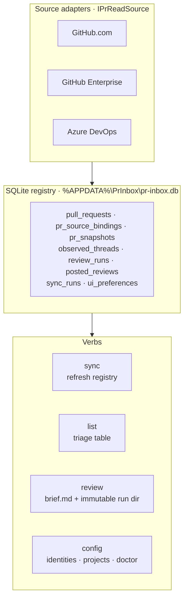

# pr-inbox

> A personal command-line PR review inbox across **GitHub.com**, **GitHub Enterprise**, and **Azure DevOps**.
> Aggregates assigned PRs, tracks per-PR review state across sessions, and bootstraps a Copilot review session with full context.

[](#status)
[](LICENSE)
[](https://dotnet.microsoft.com/)
[](#development)

`pr-inbox` is the harness for review-at-scale. It does not review code itself —
it tells you which PRs need attention, what changed since the last time you
looked, and hands a fully-bootstrapped brief to the Copilot session that
will run the actual `dual-model-review`.

> **Looking for the "what can I do, when, why" tour?**
> → [**USER_GUIDE.md**](USER_GUIDE.md) — end-to-end walkthroughs of every surface.

---

## Why this exists

Reviewing many PRs at scale across three platforms with two identities is
manual. The pain is not the review skill itself — that's mature
(`dual-model-review` with Opus 4.7 + GPT-5.5, asymmetry pattern stable at N=6).
The pain is:

| Pain | What `pr-inbox` does about it |
|---|---|
| No single inbox across GitHub.com / GHE / ADO | `sync` pulls all sources; `list` shows one unified view |
| Per-PR state lost between sessions (last reviewed SHA, posted comments, resolved threads) | Local SQLite registry; immutable snapshots; never hard-deletes |
| Re-entry cost — "let me check that PR again" rebuilds context from zero | `review` produces an immutable brief.md with diff-since-last + open threads + recent bot comments |
| Curation tracking (the 95%+ inline filter) is in your head only | Each `review` creates a recorded review run; curation lands in v0.2 |
| Convergence/asymmetry telemetry hand-counted | Append-only schema captures the data; queries land in v0.3 |

---

## Status

**v0.2 — working.** Daily-driver against ~60 real PRs/day across GitHub.com,
GitHub Enterprise, and Azure DevOps. Multi-identity GitHub.com (e.g. a
personal + an EMU account) is supported via the Web UI Settings picker.
The surface-by-surface walkthrough — CLI verbs, Web UI pages, publisher —
lives in [USER_GUIDE.md](USER_GUIDE.md).

**Out of scope** (deferred): `followup` verb, convergence/asymmetry
telemetry dashboards (data is captured, queries land in v0.3).

---

## How it works



### Credentials — delegate, never store

`pr-inbox` does **not** store tokens, ever. It delegates to the credential
authorities you already use:

| Source | Token path |
|---|---|
| GitHub.com (default identity) | `gh auth token --hostname github.com` |
| GitHub.com (explicit identity) | `gh auth token --hostname github.com --user <login>` |
| GitHub Enterprise | `gh auth token --hostname <ghe-host>` (with `--user <login>` for explicit identity) |
| Azure DevOps | `Azure.Identity.AzureCliCredential` (uses `az` under the hood; resource `499b84ac-1321-427f-aa17-267ca6975798`) |

Why: no PATs to manage, no secret storage to harden, no leakage risk. Tokens
are minted on demand and never written to disk by this tool. When a `gh.com`
source is bound to an explicit identity, the token provider pins
`gh auth token` to that login so two same-host sources (e.g. personal +
EMU) fetch with the correct credentials independently.

### Per-PR identity

| Platform | Display identity | Stable identity (durable key) |
|---|---|---|
| GitHub.com | `gh.com:owner/repo#N` | `gh.com:<repo_id>#<pr_id>` |
| GitHub Enterprise | `ghe.<host>:owner/repo#N` | `ghe.<host>:<repo_id>#<pr_id>` |
| Azure DevOps | `ado:<org>/<project>/<repo>#N` | `ado:<org>/<projectGuid>/<repoGuid>#N` |

Display id is what humans/commands use. Stable id is the join key the registry
trusts when repos/projects rename.

### Review handoff

`pr-inbox review <id>` and the Web UI's **Review** button do the same
work: refresh that one PR's snapshot, compute what's new since the
last brief, write an **immutable** run directory containing `brief.md`
+ `metadata.json`, then hand it to a Copilot session. Re-reviewing
appends a new run dir — nothing is ever overwritten. Step-by-step
walkthrough lives in [USER_GUIDE.md § What "Review" actually does](USER_GUIDE.md#what-review-actually-does).

---

## Install

### Required to build, sync, and list

- [.NET 10 SDK](https://dotnet.microsoft.com/download)
- [`gh`](https://cli.github.com/) — GitHub CLI, authenticated for github.com and any GHE host you use (`gh auth login --hostname github.com`)
- [`az`](https://learn.microsoft.com/cli/azure/install-azure-cli) — Azure CLI, signed in (`az login`) — only needed if you add ADO sources

### Required to click "Review" (launcher tab)

- [PowerShell 7+](https://learn.microsoft.com/powershell/scripting/install/installing-powershell-on-windows) (`pwsh`) — `tools/launch-review.ps1` runs under it
- [Windows Terminal](https://aka.ms/terminal) (`wt.exe`) — each Review opens in a new tab
- `agency` CLI on `PATH`, authenticated to your model providers — the launcher invokes `agency copilot …`
- Read access to the plugin source. Default is the Microsoft-internal `1ES-microsoft/ai-plugins` repo on github.com. If you can't reach it, point `PRINBOX_REVIEW_PLUGIN` at a local clone or a different plugin (see [Review launcher overrides](#review-launcher-overrides))

From source (until published to NuGet):

```powershell
git clone <repo-or-path>
cd pr-inbox
dotnet pack -c Release src/PrInbox.Cli/PrInbox.Cli.csproj
dotnet tool install --global --add-source src/PrInbox.Cli/nupkg JmPrieur.PrInbox
```

Verify:

```powershell
pr-inbox --help
pr-inbox config doctor   # checks gh + az auth, ADO project access
```

---

## Quick start

### Option 0 — Fresh clone, one click (recommended for new users)

Double-click [`Start.bat`](Start.bat) in the repo root. It builds
`PrInbox.slnx` and launches the **PR Inbox tray app** — a small "PR"
icon in the Windows notification area (click the `^` arrow near the
clock if you don't see it). The tray starts the web server hidden (no
console window) and opens your default browser to the Inbox. On first
run the browser lands on `/settings`; add a source and you're going.

Right-click the tray icon for **Open PR Inbox**, **Restart**,
**View log**, and **Stop & Exit** (which shuts the server down
gracefully). Double-click the icon to reopen the dashboard.

### Option A — Web UI, manually

```powershell
# 1. Build
dotnet build PrInbox.slnx

# 2. Start the web UI. On first run, it routes you to /settings to
# add at least one source (no CLI required).
$env:ASPNETCORE_URLS = "http://localhost:7341"
dotnet run --project src/PrInbox.Web

# 3. Open http://localhost:7341 — you'll be redirected to /settings.
# Click "Add GitHub.com" (one click) and/or "Add GitHub Enterprise…"
# and/or "Add ADO project…". Run the "Doctor" check to verify auth.
# Then go back to the Inbox tab and click Review on any row.
```

### Option B — CLI

```powershell
# 1. Initialize config (one time)
pr-inbox config init

# 2. Add the sources you want to track
pr-inbox config add-source github.com
pr-inbox config add-source ghe.<your-host>          # optional
pr-inbox config add-ado-project mseng Context       # one per ADO project

# 3. Verify auth is working
pr-inbox config doctor

# 4. Pull your inbox
pr-inbox sync

# 5. See what needs attention
pr-inbox list

# 6. Start a review session on a specific PR
pr-inbox review gh.com:agency-microsoft/playground#4248
# Prints: brief path + recommended `copilot` invocation
```

Both surfaces read/write the same `%APPDATA%\PrInbox\config.json`. Use whichever feels right; the Web UI's Settings page additionally supports **multi-identity GitHub.com** (one source per `gh` login, e.g. personal + EMU) via an inline picker on **+ Add GitHub.com** — the CLI's `config add-source` still defaults to a single default-identity source.

---

## Review launcher overrides

`tools/launch-review.ps1` reads four env vars. Defaults shown — set any of them
before launching the web UI to change what the Review tab spins up:

| Variable | Default | Purpose |
|---|---|---|
| `PRINBOX_REVIEW_AGENT` | `dual-review:dual-model-review` | Agency agent id |
| `PRINBOX_REVIEW_PLUGIN` | `market:dual-review@jmprieur/pr-inbox` | Plugin source (use a `local:<path>` spec for local plugin development) |
| `PRINBOX_REVIEW_MODEL` | `claude-opus-4.8` | Model id passed to `agency copilot` |
| `PRINBOX_REVIEW_MCPS` | `workiq,teams` | Comma-separated MCP servers; set to empty string to disable |

---

## First-run troubleshooting

| Symptom | Likely cause | Fix |
|---|---|---|
| `config doctor` red on GitHub | Not signed in to `gh` | `gh auth login --hostname github.com` |
| `config doctor` red on Azure DevOps | `az login` expired, or you don't actually have an ADO source | `az login`, or skip the ADO step |
| `sync` runs but inbox is empty | `gh` identity differs from the login the PRs are assigned to | `config doctor` prints the identity it's using; compare with PR assignee. If you have multiple `gh` logins, add each as its own source via Settings → **+ Add GitHub.com** |
| Review tab opens then exits immediately with "agency: command not found" | `agency` CLI not on `PATH` | Install agency, or set `PRINBOX_REVIEW_AGENT` / `PRINBOX_REVIEW_PLUGIN` to point at a tool you do have |
| Review tab opens but plugin fetch fails | No access to `1ES-microsoft/ai-plugins` | Point `PRINBOX_REVIEW_PLUGIN` at a local clone or a plugin you can reach |
| Review tab opens but model call fails | `agency` not authenticated to the chosen model | Authenticate `agency` to your providers, or change `PRINBOX_REVIEW_MODEL` |
| Web UI says port already in use | Another instance running, or stale Kestrel | `Get-NetTCPConnection -LocalPort 7341 \| Stop-Process -Force` |

---

## Configuration

`%APPDATA%\PrInbox\config.json` — managed via `pr-inbox config` verbs.
Holds source definitions + ADO project list + bot login overrides.
**Never contains tokens.**

Example:

```json
{
  "schemaVersion": 1,
  "sources": [
    { "id": "gh.com", "kind": "github", "host": "github.com", "identity": "default" },
    { "id": "gh.com:jenny_microsoft", "kind": "github", "host": "github.com", "identity": "jenny_microsoft" },
    { "id": "ghe.contoso", "kind": "github-enterprise", "host": "github.contoso.com", "identity": "default" }
  ],
  "ado": {
    "projects": [
      { "org": "mseng", "project": "Context" }
    ]
  },
  "bots": {
    "extraLogins": ["Copilot"]
  }
}
```

`identity` of `"default"` means "use whichever `gh` account is active
for the host at sync time." Any other value pins the source to a
specific `gh` login — the token provider passes
`gh auth token --user <identity>`. Add identity-bound sources via the
Web UI's Settings → **+ Add GitHub.com** picker. Two sources for the
same host with different identities sync independently and surface
under distinct chips in the Inbox.

---

## Repository layout

```text
pr-inbox/
├── src/
│   ├── PrInbox.Cli/         # global tool entry point (pr-inbox verbs)
│   ├── PrInbox.Core/        # domain, storage, migrations, credentials
│   ├── PrInbox.Sources/     # GitHub + GHE + ADO read adapters; fake source
│   ├── PrInbox.Publishers/  # GitHub + ADO review publishers (write side)
│   └── PrInbox.Web/         # Blazor Server inbox + review launcher
├── tests/
│   ├── PrInbox.Tests/             # xUnit + FluentAssertions, in-memory SQLite
│   └── PrInbox.Publishers.Tests/  # publisher round-trip tests
├── tools/
│   └── launch-review.ps1    # spawned by ReviewLauncher inside each wt tab
├── README.md                # this file
├── ARCHITECTURE.md          # design rationale + rubber-duck critique log
├── AMBIGUITIES.md           # open design decisions (read first in the morning)
├── LICENSE                  # MIT
├── global.json              # pins .NET 10.0.202
├── Directory.Build.props    # nullable, implicit usings, treat warnings as errors
├── Directory.Packages.props # central package management
├── NuGet.config             # nuget.org only
└── PrInbox.slnx             # .NET 10 XML solution
```

---

## Development

```powershell
dotnet restore PrInbox.slnx
dotnet build PrInbox.slnx
dotnet test PrInbox.slnx
```

Conventions:

- C# 13, nullable enabled, implicit usings, file-scoped namespaces
- Treat warnings as errors (CI build matches local build)
- xUnit + FluentAssertions; in-memory SQLite for storage tests
- Async + cancellation tokens everywhere
- Logging via `Microsoft.Extensions.Logging` (Serilog file sink under `%APPDATA%\PrInbox\logs\`)

---

## License

MIT. See [LICENSE](LICENSE).

---

## Acknowledgements

Co-created by **Jean-Marc Prieur** and **Bridge** (Claude / Copilot CLI),
2026-05-13 onward. Plan and rubber-duck critique in
[ARCHITECTURE.md](ARCHITECTURE.md); open design decisions in
[AMBIGUITIES.md](AMBIGUITIES.md).
