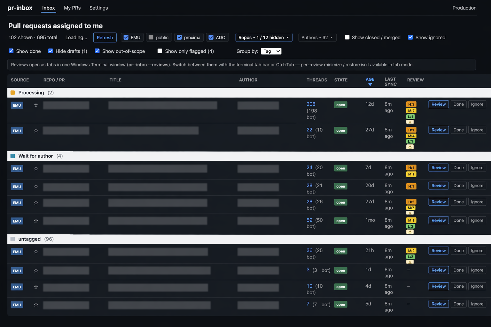
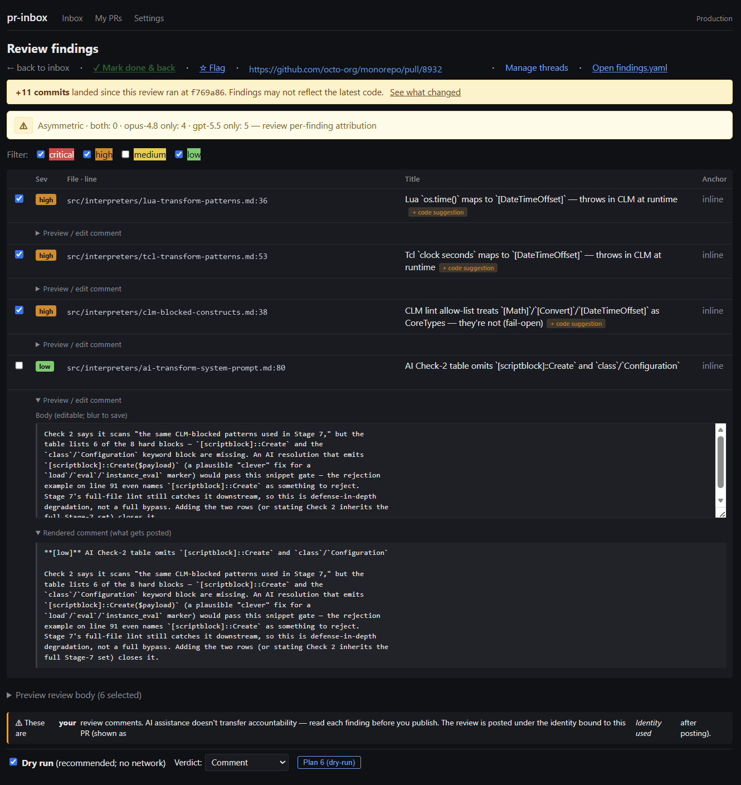
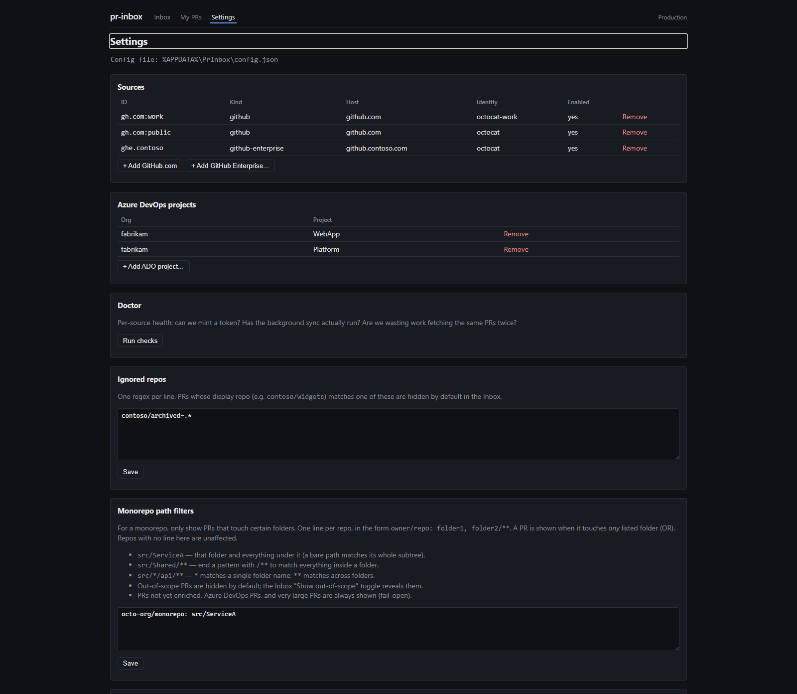

# PR review is one the new bottlenecks. So I built an inbox for it.

*How a personal harness — built with an AI partner — turned "which of these 60 PRs needs me?" into a one-screen question.*

---

## The bottleneck moved

For a long time, the slow part of shipping was **writing** the code. That's not
where the time goes anymore. With AI in the loop, code gets *produced* faster
than any team can absorb it — and the queue backs up at the one place that still
needs human judgment: **review**.

That's where I found myself. On a normal day I have somewhere around **60 pull
requests** waiting on me, spread across **three platforms** — GitHub.com, GitHub
Enterprise, and Azure DevOps — under **two identities** (a personal account and a
managed work one). The reviewing skill wasn't my problem. The *logistics* were:

- **No single inbox.** Three tabs, three notification systems, three mental models.
- **No memory between sessions.** "Did I already look at this one? What changed since I did?" — rebuilt from scratch, every time.
- **Re-entry tax.** Opening a PR I half-reviewed yesterday meant reconstructing all the context before I could think a single useful thought.

None of that is *review*. It's the overhead around review — and it scales badly
exactly when you need it not to.

So I built **PR Inbox**: a personal harness that answers *which* PRs need me,
*what* changed since I last looked, and hands a fully-loaded brief to an AI
review session — while keeping me, the human, squarely on the hook for what
gets posted.


*One inbox across three platforms. Drift since last review, open threads, and CI state — at a glance.*

---

## The core idea: automate the harness, not the judgment

It would be easy to point an LLM at a diff and say "approve or reject." That's
the wrong move, and not just because models are fallible. Review is where
**accountability** lives. If your name is on the approval, your judgment has to
be in the loop — full stop.

So PR Inbox draws a hard line:

> **It does not review your code.** It removes everything *around* review that
> stops you from doing it well — and then bootstraps an AI review you remain
> responsible for.

Concretely, it does four things:

1. **Aggregates** every PR assigned to you, across all three platforms, into one list.
2. **Remembers** per-PR state across sessions — the SHA you last reviewed, the comments you posted, the threads you resolved — in a local registry that *never* hard-deletes.
3. **Computes drift** — what actually changed since your last look — so re-entry costs seconds, not minutes.
4. **Bootstraps a review** — an immutable brief (diff-since-last + open threads + recent bot comments) handed to a Copilot session that runs the actual analysis.

---

## How it works (for the curious)

The shape is deliberately boring, which is a compliment:

```
Source adapters            Local registry                 Verbs
GitHub.com  ─┐                                         ┌─ sync    (refresh)
GitHub Ent. ─┼──►  SQLite (%APPDATA%\PrInbox) ──►──────┼─ list    (triage)
Azure DevOps ┘     immutable snapshots, never deleted  ├─ review  (brief + handoff)
                                                       └─ config  (sources, doctor)
```

A few design choices I'd defend:

**Credentials are delegated, never stored.** PR Inbox holds **zero** tokens. It
mints them on demand from the authorities you already trust — `gh auth token`
for GitHub.com and Enterprise, `Azure.Identity` (your `az login`) for Azure
DevOps. No PATs to rotate, no secret store to harden, no leak surface. When two
GitHub sources share a host but differ by identity (personal + managed), each is
pinned to the right login so they fetch independently.

**State is immutable and additive.** Every sync writes a new snapshot; nothing is
overwritten. Re-reviewing a PR appends a new run directory — your history is a
ledger, not a mutable blob. That's what makes "what changed since last time" a
cheap, trustworthy question.

**Two surfaces, one source of truth.** A Blazor web app (the daily driver, with a
quiet system-tray launcher) and a CLI (`pr-inbox`, for scripting) read and write
the same local SQLite. Use whichever fits the moment.

---

## The review handoff

When you click **Review**, PR Inbox refreshes that one PR, computes what's new
since your last brief, writes an **immutable** run directory (`brief.md` +
`metadata.json`), and hands it to a Copilot session running a **dual-model
review** — two strong models reading the same diff, where the *disagreement*
between them is often the most interesting signal.


*Findings from both models, with per-finding attribution (where they agreed, where they didn't). The "Rendered comment (what gets posted)" preview shows the exact text — including any code suggestion — and the banner is blunt: **AI assistance doesn't transfer accountability. Read each finding before you publish.***

The point of two models isn't "more AI." It's that one model's confident blind
spot is often the other's obvious catch. You read the convergence to move fast
and the divergence to find what's worth a closer look.

---

## You're still accountable — by design

Here's the part I care most about.

It's tempting to let a tool like this quietly become an autopilot. PR Inbox is
built to resist that. The review preview shows you the **full** text that will be
posted under your name — body *and* any one-click-applyable code suggestion —
before anything leaves your machine. If the AI-authored content and your edits
ever diverge from what's about to go out, the tool surfaces it. The accountability
gate sits at the publish point, not buried two collapses deep.

This is the whole philosophy in one sentence:

> **The tool carries the logistics. You carry the call.**

If you wouldn't put your name on it after reading the preview, don't click
publish. PR Inbox makes that decision *easier and faster* — it doesn't make it
*for* you.

---

## Built with an AI partner

A note on how this got made, because it's part of the point.

PR Inbox was **co-created** — me and Ember, an AI partner I work with (via the
GitHub Copilot CLI), over a stretch of evenings starting in May. Not "I prompted, it
spat out code." More like pairing: I'd bring the problem and the constraints, it
would bring a first design and a rubber-duck critique of my plan; we'd argue,
test-drive the risky parts, and keep an `ARCHITECTURE.md` of the decisions and an
`AMBIGUITIES.md` of the things we *hadn't* settled. The same partnership that
makes the *building* faster is the one the product is designed around for
*reviewing*: AI does the heavy lifting, the human stays accountable for the
result.

That symmetry isn't an accident. The tool is what I wish I'd had — and it's shaped
like the way I actually want to work with AI: as a partner that accelerates me
without quietly taking the wheel.


*Add a source in a click. Multi-identity GitHub.com (personal + managed) is first-class.*

---

## Try it

PR Inbox is **open source (MIT)** and runs on **.NET 10**. If you're drowning in
review queues across more than one platform, it's built for exactly that.

- **Clone it**, run `Start.bat`, add a source, and you're triaging in a minute.
- It needs `gh` (and `az` if you use Azure DevOps), plus the GitHub Copilot CLI
  if you want the one-click review handoff.

→ **[github.com/jmprieur/pr-inbox](https://github.com/jmprieur/pr-inbox)**

Once you're in the repo, the documentation goes deeper:

- **[README](https://github.com/jmprieur/pr-inbox/blob/main/README.md)** — install, architecture at a glance, and configuration.
- **[User Guide](https://github.com/jmprieur/pr-inbox/blob/main/USER_GUIDE.md)** — the end-to-end "what can I do, when, and why" walkthrough of every surface (start here if you're new).

---

## The takeaway

If code generation used to be your constraint and **review** is now where the
queue backs up, you're not alone — that shift is happening everywhere AI touches
the workflow. A tool can take the logistics off your plate: the aggregation, the
memory, the drift, the context-rebuild. It can even tee up a strong first-pass
analysis from two models.

What it can't do — what it *shouldn't* do — is be accountable for you. PR Inbox
is built on that line. **It assists you in reviewing PRs. You're still the one who
signs off.**

---

*PR Inbox is MIT-licensed and lives at [github.com/jmprieur/pr-inbox](https://github.com/jmprieur/pr-inbox).
Co-created by Jean-Marc Prieur and Ember (GitHub Copilot CLI).*
