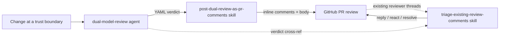

# dual-review

Dual-model code review for high-stakes changes at trust boundaries, plus a
delivery skill that turns the review verdict into inline GitHub PR comments.

## Contents

| Kind | Name | Purpose |
|---|---|---|
| Agent | [`dual-model-review`](agents/dual-model-review.md) | Orchestrates one round of review by two independent reviewer models (default: Opus + GPT) over the same change set, then cross-references their findings into a single verdict + de-duplicated finding list. One round per call; the caller iterates. |
| Skill | [`post-dual-review-as-pr-comments`](skills/post-dual-review-as-pr-comments/SKILL.md) | Converts a `dual-model-review` verdict into a single GitHub PR review with inline comments anchored to the exact lines, suggestion blocks where the fix is mechanical, and a summary body. The **outbound** path: post *our* findings. |
| Skill | [`triage-existing-review-comments`](skills/triage-existing-review-comments/SKILL.md) | The **inbound** path: adjudicate the comments already on a PR (bots like Copilot by default). Verifies each against HEAD, replies, thumbs-up the correct ones, and resolves threads that are settled **and verified** (author fixed it and we confirmed, or author rejected with evidence and we agree). Dry-run by default; mutates only on an explicit execute signal. |
| Doc | [`dual-model-review-pattern`](docs/dual-model-review-pattern.md) | The iteration loop, the model-asymmetry insight that motivates N=2 reviewers, when to invoke, and provenance. |

## How they fit together

The agent produces a structured verdict (convergent findings, unique-to-each
reviewer findings, disagreements, optional severity drift). The
`post-dual-review-as-pr-comments` skill is the canonical **outbound** delivery
path that posts it to the PR. The `triage-existing-review-comments` skill runs
the **inbound** direction — it adjudicates the comments already on the PR and
resolves the ones that are settled *and* verified. It can cross-reference the
agent's verdict, but it is invoked by the caller (operator / orchestrator), not
by the agent — keeping the reviewers blind to existing comments is what
preserves their independence. All reference the companion pattern doc.

## Requirements

- The skill uses the GitHub CLI (`gh`) to read the PR diff and post reviews.

## Provenance

Adapted from an internal code-review plugin, generalized for pr-inbox.
